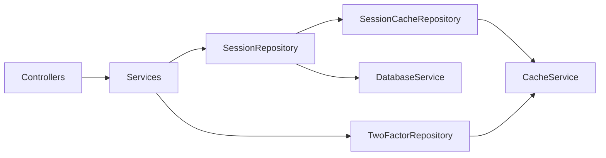

# Auth — Architecture

> [← Back to Auth README](../README.md)

## Module tree

```
src/
├── main.ts                         Bootstrap + cookie-parser
├── app.module.ts                   DatabaseModule, TokenModule, SessionModule, Throttler, Router `/auth`
├── database/                       DatabaseModule + DatabaseService (PrismaClient)
├── cache/                          CacheService — low-level get/set/del/getOrSet
│                                   CacheModule.forFeature({ prefix, defaultTtlSeconds })
├── token/                          TokenModule (@Global) — JWT + password-reset opaque tokens (Redis)
│   ├── token.module.ts
│   ├── user-token/                 UserTokenService, access/refresh JwtModule
│   └── password-reset-token/       PasswordResetTokenService + repository (Redis)
├── auth/                           AuthService — in-proc JWT + session orchestration
├── utils/
│   └── sha256.util.ts              sha256Hex (session refresh-token hash)
├── session/
│   ├── session.module.ts
│   ├── session.controller.ts       @Controller('session') — sign-out, list, revoke
│   ├── session.service.ts
│   ├── session.repository.ts       DatabaseService (sessions)
│   ├── session.constants.ts        SESSION_REFRESH_TTL_SECONDS
│   └── dto/
├── credentials/
│   ├── credentials.module.ts
│   ├── credentials.controller.ts   @IsPublic + @ClientInfo + @ResponseMessage
│   └── credentials.service.ts      emailLogin / emailRegister
├── two-factor/
│   ├── two-factor.module.ts
│   ├── two-factor.controller.ts    AuthGuard — resend-code, verify
│   ├── two-factor.service.ts
│   ├── two-factor.repository.ts    CacheService — 6-digit code + attempts per userId
│   └── two-factor.constants.ts     TWO_FACTOR_CHALLENGE_TTL_SECONDS
├── password-reset/
│   ├── password-reset.constants.ts PASSWORD_RESET_TTL_SECONDS
│   └── ...
├── email-verification/
│   ├── email-verification.module.ts
│   ├── email-verification.controller.ts AuthGuard — resend-code, verify
│   ├── email-verification.service.ts
│   ├── email-verification.repository.ts CacheService — code + attempts per userId
│   └── email-verification.constants.ts EMAIL_VERIFICATION_TTL_SECONDS
├── auth/
│   ├── auth.module.ts
│   ├── auth.controller.ts          POST /refresh (@IsPublic)
│   └── auth.service.ts             Session + token orchestration
├── user-validator/
│   ├── user-validator.module.ts
│   ├── user-validator.controller.ts
│   └── user-validator.service.ts   SessionCacheRepository fast-path + user RPC + in-proc JWT verify
└── google/                         Scaffold
```

## Internal data-access layering



**Rules (enforced via Cursor rules):**
- `DatabaseService` and `CacheService` are **only** injected into `*.repository.ts` files.
- Every HTTP endpoint has `@ResponseMessage('…')`.
- Use `@ClientInfo()` instead of manual `req.ip` / `req.headers['user-agent']`.
- Use `checkExists(...)` instead of manual null guards.

## Event emission

Auth emits domain events inline using `ClientService.emitEvent(AuthEvent.X, payload)` — no wrapper `EventsService`:

| Event | Emitter | When |
|-------|---------|------|
| `AuthEvent.SESSION_STARTED` | `AuthService` | On login / register / OAuth |
| `AuthEvent.SESSION_ENDED` | `SessionController` | On sign-out / revoke |
| `AuthEvent.ACCOUNT_EMAIL_VERIFIED` | `EmailVerificationService` | After successful email 6-digit verify |

## TODO

- **Google OAuth** wiring.
- **Forgot-password** — anti-enumeration (swallow token RPC errors); send reset email when account exists.
- **Toggle 2FA** — `User.twoFactorEnabled` in the user service (no TOTP tables in auth); wire an RPC or admin path when product needs it.
