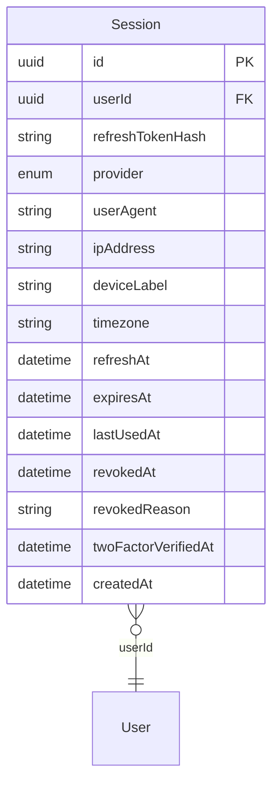

# Auth — Entities & ER

> [← Back to Auth README](../README.md)

> **Reality vs. domain model:** The canonical [Domain model](../../../../docs/02-domain-model.md) lists `Account` and token-like entities under `auth`. In **this codebase** there is no `Account`; **`User`** lives in the [user service](../../user/README.md). Short-lived JWTs and refresh token *strings* are issued **in-process** by [`src/token/`](../src/token/) (`UserTokenService`). **`auth`** persists **`Session`** (refresh hash + metadata). **Password-reset opaque tokens**, **2FA**, and **email verification codes** live in **Redis** (repositories in this service); whether the user must complete 2FA or email verification is reflected on **`User`** (`twoFactorEnabled`, `emailVerified`) in the user service.

## ER diagram (Postgres — `auth` service)

`User` is logical-only (FK target in another service). Prisma schema: [`../prisma/schema.prisma`](../prisma/schema.prisma).

## Session

| Field | Storage |
|-------|---------|
| `id` | UUID PK — embedded in JWT as `sid`. |
| `userId` | UUID — `User.id` in **user** service. |
| `refreshTokenHash` | `sha256(refreshToken)` — compared on refresh after in-process refresh JWT verification (`UserTokenService.verifyRefreshToken`). |
| `provider` | `SessionProvider` enum. |
| `userAgent`, `ipAddress`, `deviceLabel`, `timezone` | Strings / optional. |
| `refreshAt`, `expiresAt`, `lastUsedAt`, `createdAt` | Timestamps. |
| `revokedAt`, `revokedReason` | Soft revoke. |
| `twoFactorVerifiedAt` | Set when the user successfully verifies the 6-digit 2FA code for this session (cache-backed flow). |

[`SessionEntity`](../../../libs/types/src/types/session/session.type.ts) mirrors the Prisma `Session` model in `apps/auth/prisma/schema.prisma` (run `prisma generate` in the auth app). List endpoints return rows with `refreshTokenHash` redacted (empty string); a plaintext `refreshToken` is never stored in the DB.

## Two-factor and email verification (not in Postgres)

- **2FA** — `TwoFactorRepository` stores a short-lived 6-digit code and attempt counter in Redis, keyed by `userId`. Whether 2FA is required comes from **`User.twoFactorEnabled`** (user service).
- **Email verification** — `EmailVerificationRepository` stores a short-lived 6-digit code in Redis. **`User.emailVerified`** is updated via `user.email.mark_verified` after a successful verify.

## Cross-context

- **JWT & password-reset tokens** — issued and verified in-process ([`src/token/`](../src/token/)); **access** JWTs carry `id`, `email`, `sessionId`, `twoFactorVerifiedAt`, `emailVerifiedAt`, `type`, and standard `iat`/`exp`. **Refresh** JWTs carry only `id`, `sessionId`, and `type` (`refresh`). Short access TTL applies when `pendingVerification` is set at mint time.
- **User service** — `user.create`, `user.get_by_email`, `user.password.verify`, `user.get_by_id`, `user.email.mark_verified`, `user.password.update` (password reset from auth).
- **Notification service** — patterns such as `notification.send-two-factor` and `email.send-mail-confirmation` (fire-and-forget from `auth`).

## TODO

- **Google OAuth** — `Session.provider` + OAuth flow when implemented.
